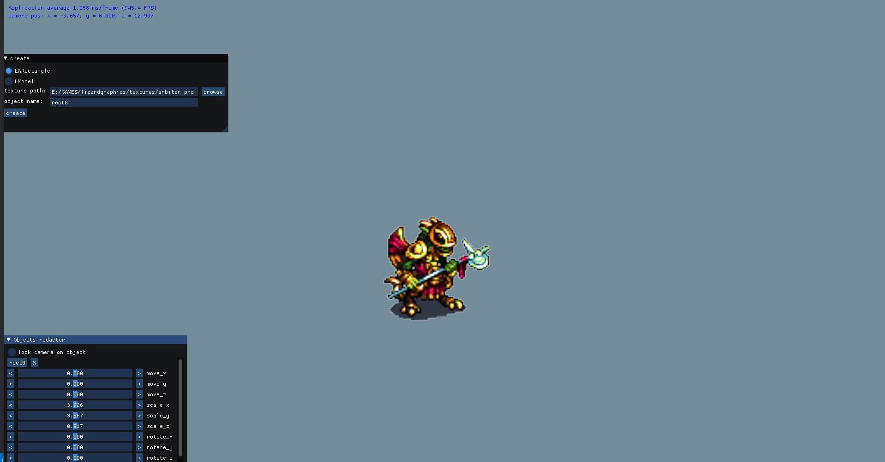

# lizardgraphics
C++ Graphics library written on OpenGL.
As GUI Lizard Graphics offering Dear ImGui lib.

Reasons to use:

1. Fast primitives renderering.
2. Сross-platform.
3. Easy to master.
4. Free.



# The necessary libraries

glfw - https://www.glfw.org/download.html

glew32 - http://glew.sourceforge.net/ or

vulkan-1 - https://www.lunarg.com/vulkan-sdk/

On Windows you need to place this static libraries in the "LizardGraphics/libs" directory.

# Building for Windows

```sh
git clone https://github.com/GercogKaban/lizardgraphics
cd /d path
cmake .
``` 

# Building for Linux

```sh
git clone https://github.com/GercogKaban/lizardgraphics
cd path
cmake .
make
```

# Examples

## Initializing LApp

```cpp
#include "LApp.h"
#include "LModel.h"

using namespace LGraphics;

int main()
{
    const size_t poolSize = 100;

    LAppCreateInfo info;

    info.anisotropy = 16;
    info.projection = L_PERSPECTIVE;
    info.saveObjects = L_TRUE;
    info.loadObjects = L_TRUE;
    info.lighting = L_TRUE;
    info.poolSize = poolSize;
    info.logFlags = ASYNC_LOG | CONSOLE_DEBUG_LOG | FILE_DEBUG_LOG | FILE_RELEASE_LOG;

    LApp app(info);
```
## Adding objects

```cpp
auto m1 = new LModel(&app,
            "models/dog/Wolf_obj.obj",      // model path
            "models/dog/Australian_Cattle_Dog_dif.jpg", nullptr, true);     // texture path

        m1->rotateX(90.0f);
        m1->rotateZ(180.0f);
        m1->move(0.0f, 10.0f, 0.0f);
```

## Setting own code before drawing loop

```cpp
    app.setBeforeDrawingFunc([&]()
        {
            if (app.isCursorEnabled())
                return;
            const float cameraSpeed = 0.002f;

            glm::vec3 cameraPos = app.getCameraPos();
            const auto cameraFront = app.getCameraFront();
            const auto cameraUp = app.getCameraUp();

            const float tempY = cameraPos.y;

            if (app.isPressed(GLFW_KEY_W))
                cameraPos += cameraSpeed * cameraFront;
            if (app.isPressed(GLFW_KEY_S))
                cameraPos -= cameraSpeed * cameraFront;
            if (app.isPressed(GLFW_KEY_A))
                cameraPos -= glm::normalize(glm::cross(cameraFront, cameraUp)) * cameraSpeed;
            if (app.isPressed(GLFW_KEY_D))
                cameraPos += glm::normalize(glm::cross(cameraFront, cameraUp)) * cameraSpeed;

            cameraPos.y = 0.0f;
            app.setCameraPos(cameraPos);
        });
```

## Adding interface

You can choose interface rom interfaces.h using ImGuiInterface class.
```cpp
    ImGuiInterface interface_(&app);
    auto f = std::bind(&ImGuiInterface::imguiInterface, &interface_);
    app.setImgui(f);
```

## Launching loop

```cpp
    app.loop();
```

# Documentation
Here you can find documentation for Lizard Graphics https://gercogkaban.github.io/lizardgraphics/index.html
